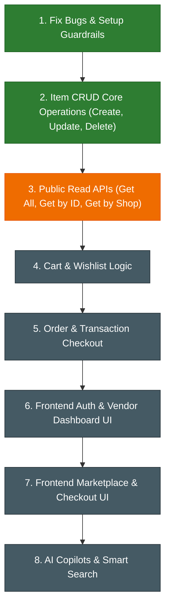

# Project Analysis & Implementation Roadmap: Best Buy

Based on a detailed review of your codebase (under `d:\work2\nvc\best_buy`), here is a clear, updated analysis of what you are building, what is currently implemented, the resolved bugs/gaps, and a roadmap of features you need to implement next.

---

## 1. What You Are Building (The Core Vision)
You are building a **Full-Stack Multi-Vendor E-Commerce Platform** (similar to a specialized Best Buy marketplace or Shopify). 
- **Roles**:
  - **Customers (`user`)**: Can browse shops, view products, add items to their cart/wishlist, place orders, and review products.
  - **Sellers (`vendor`)**: Can register, create one or more **Shops/Stores** (e.g., electronic shops, tech depots), post **Items/Products** under their shops, manage stock, and track shop orders.
  - **Administrators (`admin`)**: Can oversee the marketplace, flag/approve products/shops, and moderate transactions.

---

## 2. Tech Stack Overview
* **Backend**: Node.js, Express.js, MongoDB + Mongoose, JWT (JSON Web Tokens) for auth, Cookie-Parser for session cookies.
* **Frontend**: Next.js (App Router) using TypeScript and Tailwind CSS.

---

## 3. Current Implementation Status & Progress Tracker

### 🛠️ Backend Status: **50% Complete**
* **Database Models** ([models/](file:///d:/work2/nvc/best_buy/backend/models/)):
  * **User Model** ([user_model.js](file:///d:/work2/nvc/best_buy/backend/models/user_model.js)): Complete with name, email, address, phone number, wishlist/cart/orders/shops references, and roles (`user`, `vendor`, `admin`).
  * **Shop Model** ([shop_model.js](file:///d:/work2/nvc/best_buy/backend/models/shop_model.js)): Complete with vendor association, slug generation, name, description, and items array.
  * **Item Model** ([item_model.js](file:///d:/work2/nvc/best_buy/backend/models/item_model.js)): Complete, supporting price, rating, reviews, stock, vendor, shop, and tags. **Duplicate schema field bug resolved!**
  * **Order Model** ([order_model.js](file:///d:/work2/nvc/best_buy/backend/models/order_model.js)): Structure defined with user, items list, total price, quantity, and status.
* **Controllers** ([controllers/](file:///d:/work2/nvc/best_buy/backend/controllers/)):
  * **Auth Controller** ([auth_controller.js](file:///d:/work2/nvc/best_buy/backend/controllers/auth_controller.js)): Complete with registration, `loginAsUser`, and `loginAsVendor`.
  * **Shop Controller** ([shop_controller.js](file:///d:/work2/nvc/best_buy/backend/controllers/shop_controller.js)): Complete with `createShop` (utilizes dynamic helper to auto-generate unique slug names).
  * **Item Controller** ([item_controller.js](file:///d:/work2/nvc/best_buy/backend/controllers/item_controller.js)): Write operations implemented!
    * `createItem` (creates products, ensures vendor is the owner of the target shop, pushes item ID reference to shop's inventory).
    * `updateItem` (modifies name, price, stock, description, image, and secondary description; enforces vendor ownership of the item).
    * `deleteItem` (removes product from database and pulls the reference out of the corresponding shop's `items` array; allows vendors or system admins to delete).
  * **Order Controller** ([order_controller.js](file:///d:/work2/nvc/best_buy/backend/controllers/order_controller.js)): Contains a stub function `placeOrder` (needs implementation).
* **Middlewares** ([middlewares/](file:///d:/work2/nvc/best_buy/backend/middlewares/)):
  * **Auth Middleware** ([auth_middleware.js](file:///d:/work2/nvc/best_buy/backend/middlewares/auth_middleware.js)): Complete. **Hanger bug resolved!** Token verification handles errors and gracefully responds with 401 unauthorized status.
  * **Role Guarding**: Complete. Added the `authorize(...roles)` function to restrict endpoints to matching user roles (e.g. restricts product creation exclusively to verified `"vendor"` users).
* **Routes** ([routes/](file:///d:/work2/nvc/best_buy/backend/routes/)):
  * Auth routes ([auth_routes.js](file:///d:/work2/nvc/best_buy/backend/routes/auth_routes.js)) registered in [index.js](file:///d:/work2/nvc/best_buy/backend/index.js).
  * Shop routes ([shop_routes.js](file:///d:/work2/nvc/best_buy/backend/routes/shop_routes.js)) registered in [index.js](file:///d:/work2/nvc/best_buy/backend/index.js).
  * Item routes ([item_routes.js](file:///d:/work2/nvc/best_buy/backend/routes/item_routes.js)) registered in [index.js](file:///d:/work2/nvc/best_buy/backend/index.js).

### 💻 Frontend Status: **10% Complete**
* A Next.js App Router project initialized with Tailwind CSS.
* **Homepage** ([app/page.tsx](file:///d:/work2/nvc/best_buy/frontend/app/page.tsx)): Basic text entry saying "Home Page".
* **Login Form** ([app/login/page.tsx](file:///d:/work2/nvc/best_buy/frontend/app/login/page.tsx)): Basic form stub containing an email input field and an title header.

---

## 4. Gaps Resolved & Fixed Issues

> [!TIP]
> **1. Hanger Bug in Auth Middleware (FIXED)**
> Previously, the `protect` middleware would hang the server request indefinitely if headers were missing or authorization token parsing failed. The current implementation in [auth_middleware.js](file:///d:/work2/nvc/best_buy/backend/middlewares/auth_middleware.js) correctly returns `response(res, 401, "unauthenticated", ...)` when token validation fails.

> [!TIP]
> **2. Duplicate `shop` Field in Item Model (FIXED)**
> The redundant duplicate configuration of the `shop` field in [item_model.js](file:///d:/work2/nvc/best_buy/backend/models/item_model.js) has been removed, resolving schema validation errors.

> [!TIP]
> **3. Role-Based Route Guarding (COMPLETED)**
> Added a flexible `authorize(...roles)` function in [auth_middleware.js](file:///d:/work2/nvc/best_buy/backend/middlewares/auth_middleware.js). E.g. `authorize('vendor')` protects vendor-specific operations.

---

## 5. Upcoming Implementation Phases

### Phase 1: Backend Query APIs (In Progress)
1. **Public/Query Item Retrieval** (`item_controller.js`):
   * `getItemById`: GET `/api/item/:id` - Fetch detailed information about a single product (accessible to anyone).
   * `getAllItems`: GET `/api/item/` - Retrieve all products (catalog page with query parameters/filters like `tag`, `name`, or `secondaryDescription`).
   * `getAllItemsForShop`: GET `/api/item/shop/:shopId` or `/api/item/shop/slug/:slug` - List all products belong to a specific vendor store.
2. **Registration in Routes**: Map these public query controllers to matching GET handlers in [item_routes.js](file:///d:/work2/nvc/best_buy/backend/routes/item_routes.js) (without using the `protect` middleware, so public guests can browse).

### Phase 2: Cart, Wishlist & Transaction Logic
1. **Cart & Wishlist Controller**:
   * Create endpoints to add/remove/view items in a customer's cart or wishlist array.
2. **Order Checkout Flow** (`order_controller.js`):
   * Implement `placeOrder`:
     * Perform stock validation.
     * Decrement item inventory stock upon checkout.
     * Create the transaction Order document.
     * Clear customer cart sub-document array.
   * `getMyOrders`: GET `/api/orders/my-orders` for shoppers.
   * `getShopOrders`: GET `/api/orders/shop-orders` for vendors to review product purchases.

### Phase 3: Frontend Development (Next.js Application)
1. **Authentication Screens**:
   * Complete login pages with validation, error handling, and role selection.
   * Add a gorgeous Register page (name, email, password, address, telephone, role).
   * Persist JWT access token in state/cookies.
2. **Vendor Dashboard**:
   * "Create Store" panel (visible if the logged-in vendor does not own a store).
   * Product Management interface where vendors can list, edit, or delete items.
   * Vendor orders panel showing purchase history and shipping details.
3. **Consumer Marketplace**:
   * **Homepage**: Premium UI featuring active categories, a hero carousel, and sections for `"best seller"` and `"limited edition"` items.
   * **Shop View**: Browse `/shop/[slug]` with store description and a grid displaying their catalog.
   * **Product Page**: Visual showcase with stars rating, detailed specifications, and a prominent "Add to Cart" button.
   * **Checkout Flow**: Complete cart slides or dedicated order checkout page.

---

## 6. Advanced AI Features (Future Integration)
* **SEO Copywriter for Vendors**: Integrate an LLM (e.g. Gemini Pro API) to generate rich, SEO-optimized product description paragraphs from simple vendor input tags.
* **Semantic Search**: Use high-dimensional vector embeddings to allow users to search products via semantic intent instead of exact keyword match.
* **Inventory Forecasting**: Add a lightweight predictive analytics chart for vendor dashboards using sales records.
* **Shopping RAG Assistant**: Embed a responsive chat assistant floating bubble on product pages to answer specific shopper questions about items.
