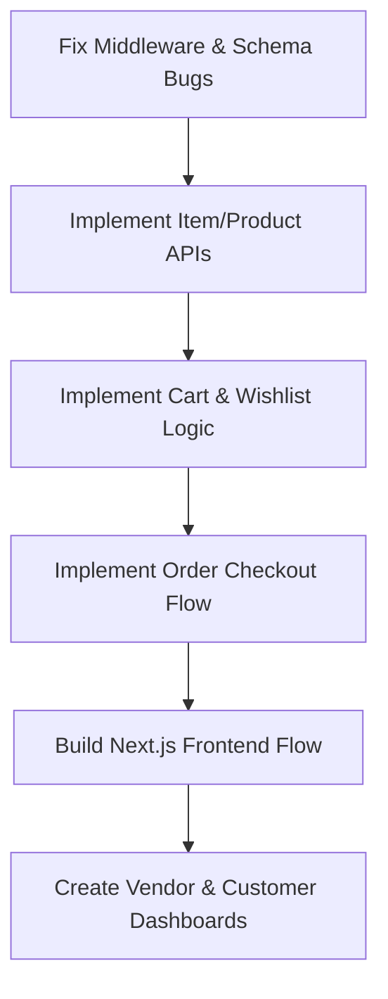

# Project Analysis & Implementation Roadmap: Best Buy

Based on a detailed review of your codebase (under `d:\work2\nvc\best_buy`), here is a clear analysis of what you are building, what is currently implemented, the bugs/gaps identified, and a roadmap of features you need to implement.

---

## 1. What You Are Building (The Core Vision)
You are building a **Full-Stack Multi-Vendor E-Commerce Platform** (similar to a specialized Best Buy marketplace, Etsy, or Shopify). 
- **Roles**:
  - **Customers (`user`)**: Can browse shops, view products, add items to their cart/wishlist, place orders, and review products.
  - **Sellers (`vendor`)**: Can register, create one or more **Shops/Stores** (e.g., electronic shops, tech depots), post **Items/Products** under their shops, manage stock, and track shop orders.
  - **Administrators (`admin`)**: Can oversee the marketplace, flag/approve products/shops, and moderate transactions (schema support present).
  
---

## 2. Tech Stack Overview
* **Backend**: Node.js, Express.js, MongoDB + Mongoose, JWT (JSON Web Tokens) for auth, Bcrypt for password security.
* **Frontend**: Next.js (App Router) using TypeScript and Tailwind CSS.

---

## 3. Current Implementation Status

### 🛠️ Backend
* **Database Models** (`/backend/models`):
  * **User Model**: Complete with name, email, address, phone number, wishlist/cart/orders/shops references, and roles (`user`, `vendor`, `admin`).
  * **Shop Model**: Complete with vendor association, slug generation, name, description, and image URL.
  * **Item Model**: Structure defined, supporting price, rating, reviews, stock, vendor, shop, and tags like `"best seller"`, `"limited edition"`.
  * **Order Model**: Structure defined with user, item list, total price, quantity, and status (`pending`, `completed`, `cancelled`).
* **Controllers** (`/backend/controllers`):
  * **Auth Controller**: Implements registration, `loginAsUser`, and `loginAsVendor`.
  * **Shop Controller**: Implements `createShop` (automatically generates a slug using a helper function).
  * **Item Controller**: Bare skeleton (only an empty `createItem` function signature).
* **Middlewares** (`/backend/middlewares`):
  * `auth_middleware.js` includes a token-checking `protect` function.
* **Routes** (`/backend/routes`):
  * `/api/auth` (registered in `index.js`).
  * `/api/shop` (registered in `index.js`).
  * `/api/item` (exists as a stub, not yet registered in `index.js`).

### 💻 Frontend
* A Next.js App Router project initialized with Tailwind CSS.
* An entry point `page.tsx` displaying "Home Page".
* A skeleton `login/page.tsx` with a basic box and a single email input.

---

## 4. Current Gaps & Code Issues (Bugs to Fix First)

Before starting on new features, we should address these minor issues:

> [!WARNING]
> **1. Hanger Bug in Auth Middleware (`/backend/middlewares/auth_middleware.js`)**
> If the `Authorization` header is missing, expired, or invalid, the middleware doesn't return an error response or call `next()`. The client request will hang indefinitely. We need to send a `401 Unauthorized` response when token validation fails.

> [!WARNING]
> **2. Duplicate `shop` Field in Item Model (`/backend/models/item_model.js`)**
> The `shop` field is defined twice (on line 10 and line 13). We should remove the second one.

> [!NOTE]
> **3. Role-Based Route Guarding**
> Vendors shouldn't be able to buy products on customer accounts, and customers shouldn't be able to create shops or add items. We need a `restrictTo(...roles)` middleware to secure vendor-only endpoints.

> [!NOTE]
> **4. Cart & Wishlist Models**
> The `user_model.js` references `"cart"` and `"whishlist"` models, but no such models exist yet. We can either create them or manage the cart/wishlist directly as sub-documents/arrays in the User schema.

---

## 5. Feature Implementation Roadmap

Here is the step-by-step roadmap to bring your platform to life:

### Phase 1: Backend Completion (The Engine)
1. **Fix Bugs**: Correct the duplicate schema field in `item_model.js` and improve error-handling in `auth_middleware.js`.
2. **Role Middleware**: Add a role-check helper (e.g. `restrictTo("vendor")`) in the authorization middleware.
3. **Item CRUD Operations** (`item_controller.js`):
   * `createItem`: Allows a logged-in vendor to add items to their shop.
   * `updateItem` / `deleteItem`: Allows vendors to edit or remove their own products.
   * `getItemById` & `getAllItems`: Allows customers to view single products or catalog lists.
   * `getAllItemsForShop`: Lists items for a specific shop.
4. **Route Integration**: Connect the `item_routes.js` to `/api/item` in `index.js`.

### Phase 2: Cart, Wishlist & Transaction Logic
1. **Cart & Wishlist APIs**:
   * API to add/remove/view items in a customer's cart.
   * API to add/remove/view items in a customer's wishlist.
2. **Order Flow**:
   * A POST route `/api/orders` to checkout. It should:
     * Check if items are in stock.
     * Decrement item stock upon success.
     * Create an Order document.
     * Empty the user's cart.
   * A GET route `/api/orders/my-orders` for customers.
   * A GET route `/api/orders/shop-orders` for vendors to see what has been purchased from their shops.

### Phase 3: Frontend Development (The Shell)
1. **Authentication UI**:
   * Complete the login page with beautiful fields and a toggle between Customer & Vendor.
   * Create a registration page with forms for name, email, password, role, address, and phone number.
   * Use cookies or state variables to store the JWT token and current user info.
2. **Vendor Dashboard**:
   * A "Create Shop" screen (if the vendor doesn't have one).
   * A product management screen where vendors can add products (name, description, price, image, stock, tags) and view their active items.
   * An orders tracker to see incoming purchases.
3. **Customer Marketplace UI**:
   * **Homepage**: Hero banner, featured categories, and a section for "Best Sellers" or "Limited Edition" items.
   * **Shop Pages**: Visiting `bestbuy.com/shop/[slug]` displays the vendor's banner, description, and list of products in their store.
   * **Product Details**: Dedicated page with high-quality image, reviews list, rating stars, and an "Add to Cart" button.
   * **Cart & Checkout**: A slide-out panel or dedicated route showing items, total price, and a "Place Order" button.
   * **Order History**: A simple user profile page showing their ordered items and their status (`pending`, `completed`, `cancelled`).

   ## AI integration
 Integrating AI into your multi-tenant e-commerce platform optimizes both the vendor and 
 customer experiences by decoupling heavy AI processing from your core MERN stack through 
 external LLM APIs and a vector database extension like `pgvector`. On the vendor side, the 
 platform streamlines operations by leveraging LLMs to instantly generate SEO-optimized product 
 copy from basic attributes and utilizing time-series forecasting models to predict inventory 
 demand based on historical transaction data. Simultaneously, the customer experience is 
 enhanced through semantic search—which utilizes high-dimensional vector embeddings to 
 understand shopper intent beyond exact keyword matches—and contextual RAG (Retrieval-Augmented
 Generation) shopping assistants that answer product queries in real time. To maintain 
 production stability, these features are wrapped in strict tenant-isolation filters to prevent 
 cross-shop data leaks and protected by aggressive rate-limiting middleware to manage 
 operational API costs.
